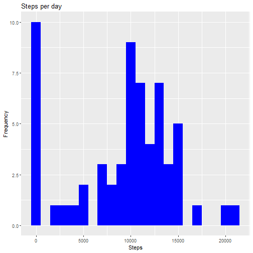
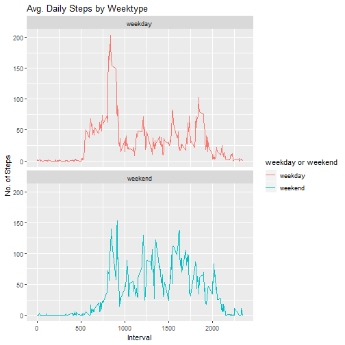

## Introduction

It is now possible to collect a large amount of data about personal
movement using activity monitoring devices such as a
[Fitbit](http://www.fitbit.com), [Nike Fuelband](http://www.nike.com/us/en_us/c/nikeplus-fuelband), or
[Jawbone Up](https://jawbone.com/up). These type of devices are part of
the "quantified self" movement -- a group of enthusiasts who take
measurements about themselves regularly to improve their health, to
find patterns in their behavior, or because they are tech geeks. But
these data remain under-utilized both because the raw data are hard to
obtain and there is a lack of statistical methods and software for
processing and interpreting the data.

This assignment makes use of data from a personal activity monitoring
device. This device collects data at 5 minute intervals through out the
day. The data consists of two months of data from an anonymous
individual collected during the months of October and November, 2012
and include the number of steps taken in 5 minute intervals each day.

## Data

The data for this assignment can be downloaded from the course web
site:

* Dataset: [Activity monitoring data](https://d396qusza40orc.cloudfront.net/repdata%2Fdata%2Factivity.zip) [52K]

The variables included in this dataset are:

* **steps**: Number of steps taking in a 5-minute interval (missing
    values are coded as `NA`)

* **date**: The date on which the measurement was taken in YYYY-MM-DD
    format

* **interval**: Identifier for the 5-minute interval in which
    measurement was taken


The dataset is stored in a comma-separated-value (CSV) file and there
are a total of 17,568 observations in this
dataset.


## Loading and preprocessing the data
Checks to see if the data is downloaded and then downloads when applicable
Once downloaded it will unzip the file to obtain the csv

```r
library(data.table)
library(ggplot2)


file1.name <- "./activity.csv"
download.url <- "https://d396qusza40orc.cloudfront.net/repdata%2Fdata%2Factivity.zip"
zip.name  <- "./data.zip"

if (!file.exists(file1.name)) {
  download.file(download.url, destfile = zip.name)
  unzip(zip.name)
  file.remove(zip.name)
}
```
Once we have the CSV we can read it then save it as a Data.Table


```r
data <- read.csv("activity.csv", header = TRUE, sep = ",", na.strings = "NA")
setDT(data)
```


## What is mean total number of steps taken per day?
1.) Calculate the total number of steps taken per day (along with a sample display)


```r
Total_Steps <- data[, c(lapply(.SD, sum, na.rm = FALSE)), .SDcols = c("steps"), by = .(date)] 

head(Total_Steps, 5)
```

```
##          date steps
## 1: 2012-10-01    NA
## 2: 2012-10-02   126
## 3: 2012-10-03 11352
## 4: 2012-10-04 12116
## 5: 2012-10-05 13294
```

2) Make a histogram of the total number of steps taken each day.

```r
ggplot(Total_Steps, aes(x = steps)) +
    geom_histogram(fill = "blue", binwidth = 1000) +
    labs(title = "Daily Steps", x = "Steps", y = "Frequency")
```

```
## Warning: Removed 8 rows containing non-finite values (stat_bin).
```


3. Calculate and report the mean and median of the total number of steps taken per day

```r
Total_Steps[, .(Mean_Steps = mean(steps, na.rm = TRUE), Median_Steps = median(steps, na.rm = TRUE))]
```

```
##    Mean_Steps Median_Steps
## 1:   10766.19        10765
```

## What is the average daily activity pattern?
1. Make a time series plot of the 5-minute interval (x-axis) and the average number of steps taken, averaged across all days (y-axis)


```r
AveragePatternDT <- data[, c(lapply(.SD, mean, na.rm = TRUE)), .SDcols = c("steps"), by = .(interval)] 

ggplot(AveragePatternDT, aes(x = interval , y = steps)) + geom_line(color="blue", size=1) + labs(title = "Avg. Daily Steps", x = "Interval", y = "Avg. Steps per day")
```


2. Which 5-minute interval, on average across all the days in the dataset, contains the maximum number of steps?


```r
AveragePatternDT[steps == max(steps), .(max_interval = interval)]
```

```
##    max_interval
## 1:          835
```

## Imputing missing values
1. Calculate and report the total number of missing values in the dataset (i.e. the total number of rows with NA's)
``{r echo=TRUE}
data[is.na(steps), .N ]
```

2. Devise a strategy for filling in all of the missing values in the dataset. The strategy does not need to be sophisticated. For example, you could use the mean/median for that day, or the mean for that 5-minute interval, etc.


```r
# Filling in missing values with median of dataset. 
data[is.na(steps), "steps"] <- data[, c(lapply(.SD, median, na.rm = TRUE)), .SDcols = c("steps")]
```

3. Create a new dataset that is equal to the original dataset but with the missing data filled in.


```r
data.table::fwrite(x = data, file = "./tidyData.csv", quote = FALSE)
```

4. Make a histogram of the total number of steps taken each day and calculate and report the mean and median total number of steps taken per day. Do these values differ from the estimates from the first part of the assignment? What is the impact of imputing missing data on the estimates of the total daily number of steps?


```r
# total number of steps taken per day
Total_Steps <- data[, c(lapply(.SD, sum)), .SDcols = c("steps"), by = .(date)] 

# mean and median total number of steps taken per day
Total_Steps[, .(Mean_Steps = mean(steps), Median_Steps = median(steps))]
```

```
##    Mean_Steps Median_Steps
## 1:    9354.23        10395
```

```r
ggplot(Total_Steps, aes(x = steps)) + geom_histogram(fill = "blue", binwidth = 1000) + labs(title = "Steps per day", x = "Steps", y = "Frequency")
```


Yes the values differ - they are noticably smaller thus filling in the missing data vaalues has lowered the initial estimates.

## Are there differences in activity patterns between weekdays and weekends?

1. Create a new factor variable in the dataset with two levels - "weekday" and "weekend" indicating whether a given date is a weekday or weekend day.


```r
# reading the CSV again so that the estimated values dont affect the outcome 
data <- read.csv("activity.csv", header = TRUE, sep = ",", na.strings = "NA")
setDT(data)
data[, date := as.POSIXct(date, format = "%Y-%m-%d")]
data[, `Day of Week`:= weekdays(x = date)]
data[grepl(pattern = "Monday|Tuesday|Wednesday|Thursday|Friday", x = `Day of Week`), "weekday or weekend"] <- "weekday"
data[grepl(pattern = "Saturday|Sunday", x = `Day of Week`), "weekday or weekend"] <- "weekend"
data[, `weekday or weekend` := as.factor(`weekday or weekend`)]

head(data, 5)
```

```
##    steps       date interval Day of Week weekday or weekend
## 1:    NA 2012-10-01        0      Monday            weekday
## 2:    NA 2012-10-01        5      Monday            weekday
## 3:    NA 2012-10-01       10      Monday            weekday
## 4:    NA 2012-10-01       15      Monday            weekday
## 5:    NA 2012-10-01       20      Monday            weekday
```

2. Make a panel plot containing a time series plot t of the e interval (x-axis) and the average number of steps taken, averaged across all weekday days or weekend days (y-axis). See the README file in the GitHub repository to see an example of what this plot should look like using simulated data.


```r
data[is.na(steps), "steps"] <- data[, c(lapply(.SD, median, na.rm = TRUE)), .SDcols = c("steps")]
AveragePatternDT <- data[, c(lapply(.SD, mean, na.rm = TRUE)), .SDcols = c("steps"), by = .(interval, `weekday or weekend`)] 

ggplot(AveragePatternDT , aes(x = interval , y = steps, color=`weekday or weekend`)) + geom_line() + labs(title = "Avg. Daily Steps by Weektype", x = "Interval", y = "No. of Steps") + facet_wrap(~`weekday or weekend` , ncol = 1, nrow=2)
```



